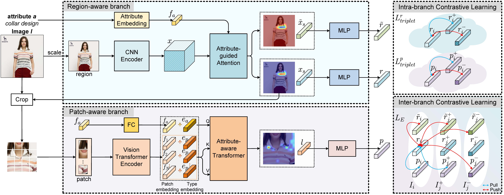

# From Region to Patch: Attribute-Aware Foreground-Background Contrastive Learning for Fine-Grained Fashion Retrieval
This is a repository contains the implementation of API based on SIGIR'23 full paper [From Region to Patch: Attribute-Aware Foreground-Background Contrastive Learning for Fine-Grained Fashion Retrieval](https://doi.org/10.48550/arXiv.2305.10260).


## Abstract
Attribute-specific fashion retrieval (ASFR), a nuanced task in content-based image retrieval, focuses on identifying specific attributes and details in fashion items from images. Addressing this complex challenge, in this report, we introduce a novel Fine-grained Fashion Retrieval system, leveraging the Region-to-Patch Framework (RPF) enhanced with large-scale search techniques including K-D tree, LSH and FAISS. Our system uniquely addresses the challenge of attribute-specific fashion retrieval by integrating dual modal inputs: an image query and a text-based attribute description. Furthermore, we present a comprehensive re-evaluation of our system against the original RPF and other state-of-the-art methods on a benchmark dataset of 180k fashion images.

## Team Members
| **Full Name**      | **MSSV** | **Role**   |
| :----------------: | :------: | :--------: |
| *Nguyen Viet Nhat*   | *21520378* | *Leader* |
| Ha Van Hoang       | 215200xx | Member     |
| Nguyen Quoc Truong | 2152xxxx | Member     |
| Vo Thi Phuong Anh  | 2152xxxx | Member     | 

## Table of Contents

* [Environments](#environments)
* [System](#system)
* [Datasets](#datasets)
* [Configuration](#configuration)
* [Training](#training)
* [Evaluation](#evaluation)
* [Performance](#performance)

## Environments
- **Ubuntu** 22.04
- **CUDA** 11.7
- **Python** 3.7

Create virtual environment for python3.7
```sh
pip install virtualenv
virtualenv --python="path/to/python3.7" py37
source py37/bin/activate
```

Install other required packages by
```sh
pip install -r requirements.txt
```

## System
- **Input**: 
  - Fashion image (*visual data*)
  - Attributes (*textual data*) 

- **Output**:
  - Ranked list of fashion items (expressed by image_id in database) that relevant to attributes in query image.

- **Example**:
```python
Input:
{
  "img_path": "path/to/query/image",
  "attrs": "Độ dài tay; Thiết kế cổ áo; Độ dài váy"
}

Output:
{
  "ids": [ 124, 768, 1243, 8940, ... ],
  "similarities": [ 0.94295, 0.87365, 0.7645, 0.652, ... ],
  "retrieval_times": 0.566
}
```


## Datasets
In this API, we use only two fashion related datasets, i.e., FashionAI and DeepFashion. The former is used for training (train, dev) and as collection (test 14400 images), while the latter is used for evaluating system. Please download and put them in the corresponding folders.
### Download Data
#### FashionAI

As the full FashionAI has not been publicly released, we utilize its early version for the [FashionAI Global Challenge 2018](https://tianchi.aliyun.com/competition/entrance/231671/introduction?spm=5176.12281949.1003.9.493e3eafCXLQGm). You can first sign up and download two training subsets:

- **fashionAI_attributes_train1.zip(6G)**
- **fashionAI_attributes_train2.zip(7G)**. 

Once done, you should uncompress and link them into the `data/FashionAI` directory.

#### DeepFashion

[DeepFashion](https://www.cv-foundation.org/openaccess/content_cvpr_2016/papers/Liu_DeepFashion_Powering_Robust_CVPR_2016_paper.pdf) is a large dataset which consists of four benchmarks for various tasks in the field of clothing including [category and attribute prediction](http://mmlab.ie.cuhk.edu.hk/projects/DeepFashion.html) which we use for our experiments, in-shop clothes retrieval, fashion landmark  detection and consumer-to-shop clothes retrieval. Download the images into a `img` directory that should be created in `data/DeepFashion` directory.

### Configuration

The behavior of our codes is controlled by configuration files under the `config` directory. 

```sh
config
│── FashionAI
│   ├── FashionAI.yaml
│   ├── s1.yaml
│   └── s2.yaml
├── DARN
│   ├── DARN.yaml
│   ├── s1.yaml
│   └── s2.yaml
└── DeepFashion
    ├── DeepFashion.yaml
    ├── s1.yaml
    └── s2.yaml
```

Each dataset is configured by two types of configuration files. One is `<Dataset>.yaml` that specifies basic dataset information such as path to the training data and annotation files. The other two set some training options as needed.

If the above `data` directory is placed at the same level with `main.py`, no changes are needed to the configuration files. Otherwise, be sure to correctly configure relevant path to the data according to your working environment.

## Startup

Download Google pre-trained ViT models for Patch-aware Branch and put into `pretrained` dir:
```bash
wget https://drive.google.com/file/d/1N2rdQcbhegIOB4fHpifi92w1Lp86umN1/view?usp=sharing
```

Pre-trained ResNet model for Region-aware Branch is auto downloaded and put into `pretrained` directory, but if error occurs, copy it manually into `pretrained` directory.

Download checkpoint for FashionAI models and place in `runs/FashionAI_s2`
- RPF on FashionAI: [released_model](https://drive.google.com/file/d/1pIJ2REblm2eXNq81vyhAj9bs8y1EzNvR/view?usp=sharing)

In this API, we implemented the multi-attributes version for input query. Therefore, we need to download the [collections](https://onedrive.live.com/?authkey=%21ALkPPaOECy0QoUM&id=406CC5EDDBB3A996%2119523&cid=406CC5EDDBB3A996&parId=root&parQt=sharedby&o=OneUp), extract it and put into `collections/multi_attrs/` directory. Single-attribute version is smaller and quicker but lack of practical, so we omit it, but if you concern it, feel free to contact 21520378@gm.uit.edu.vn

API is hosted at `0.0.0.0:8000` and receive HTTP POST at `0.0.0.0:8000/submit`
```sh
uvicorn my_api:app *or* python my_api.py
```

### Performance 
Expected MAP on FashionAI Dataset
|             |skirt length| sleeve length| coat length |pant length |collar design| lapel design| neckline design| neck design| overall|
| :---------: | :--: | :--: | :--: | :---: | :---: |:--: | :--: | :---: | :---: |
|None| 58.09 |49.88 |47.16|60.68|66.87|60.99|56.95|56.61|57.15|
|KDTree| 58.09 |49.88 |47.16|60.68|66.87|60.99|56.95|56.61|57.15|
|LSH|?|?|?|?|?|?|?|?|?|
|Faiss| 58.09 |49.88 |47.16|60.68|66.87|60.99|56.95|56.61|57.15|

Expected MAP on DeepFashion Dataset
|             |texture |fabric |shape |part| style |overall|
| :---------: | :--: | :--: | :--: | :---: | :---: | :---: |
|None|14.30|6.82|12.38|6.38|4.01|8.78|
|KDTree|14.30|6.82|12.38|6.38|4.01|8.78|
|LSH|?|?|?|?|?|?|
|Faiss|14.30|6.82|12.38|6.38|4.01|8.78|
## Citation
If you find this repository useful, please consider citing our paper:
```
@inproceedings{RPF2023,
  title={From Region to Patch: Attribute-Aware Foreground-Background Contrastive Learning for Fine-Grained Fashion Retrieval},
  author={Jianfeng Dong and Xiaoman Peng and Zhe Ma and Daizong Liu and Xiaoye Qu and Xun Yang and Jixiang Zhu and Baolong Liu},
  booktitle={Proceedings of the 46rd International ACM SIGIR Conference on Research and Development in Information Retrieval},
  year={2023}
}

```
